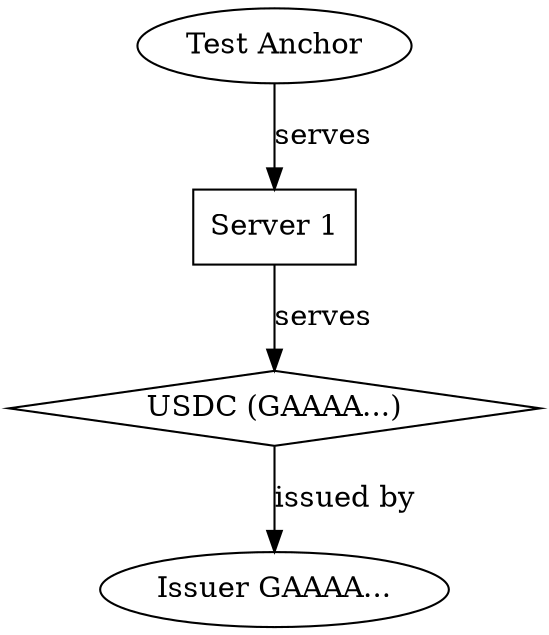

# stellar-toml-lint

Validate a Stellar Info File (`stellar.toml`) against **[SEP-1]** — offline, before you deploy it.

[](https://github.com/anchor-tools/stellar-toml-lint/actions/workflows/ci.yml)
[](https://www.npmjs.com/package/stellar-toml-lint)
[](./LICENSE)

Documentation website: [stellar-toml-lint docs](https://anchor-tools.github.io/stellar-toml-lint/)

```console
$ npx stellar-toml-lint public/.well-known/stellar.toml

public/.well-known/stellar.toml
  12:1      error    NETWORK_PASSPHRASE has stray whitespace; it must match the Public passphrase byte for byte  network/passphrase
            ↳ Replace it with exactly: Public Global Stellar Network ; September 2015
  31:1      error    CURRENCIES[0].issuer is not a valid Stellar account ID  currencies/issuer-or-contract
            ↳ Check for a transcription error — the checksum does not match.
  34:1      error    CURRENCIES[0] sets fixed_number and is_unlimited, but these issuance policies are mutually exclusive  currencies/issuance-exclusive
            ↳ SEP-1 requires exactly one of fixed_number, max_number, or is_unlimited.
  19:1      warning  DOCUMENTATION.ORG_PHONE_NUMBER is not in E.164 format  documentation/phone-e164
            ↳ Use a leading + and digits only, e.g. "+14155552671".

  4 problems (3 errors, 1 warning, 0 infos)
```

## Why this exists

The official [`@stellar/anchor-tests`][anchor-tests] suite is thorough, but it tests a **live
domain**. That means you find out your info file is broken _after_ you have shipped it — and you
cannot run it in the pull request that introduced the mistake.

`stellar-toml-lint` reads a local file. It runs in a pre-commit hook, in CI, or on your laptop before
a domain exists at all. It is complementary to `anchor-tests`, not a replacement: this catches
everything checkable from the file itself, then hands off to `anchor-tests` for the parts that need
running services.

|                                 | `stellar-toml-lint` | `@stellar/anchor-tests` |
| ------------------------------- | ------------------- | ----------------------- |
| Lints a local file              | ✅                  | ❌                      |
| Needs a deployed domain         | ❌                  | ✅                      |
| Line and column for each fault  | ✅                  | ❌                      |
| Validates key checksums         | ✅                  | partial                 |
| SARIF / code scanning output    | ✅                  | ❌                      |
| Tests live SEP-6/10/24/31 flows | ❌                  | ✅                      |

Because it validates Stellar keys with `@stellar/stellar-base`, it verifies the **CRC16 checksum** —
so a single transposed character in an issuer address is caught, which a `/^G[A-Z2-7]{55}$/` regex
would wave straight through.

## Install

```bash
npm install --save-dev stellar-toml-lint   # project dependency
npx stellar-toml-lint                      # or just run it
```

### Homebrew

```bash
brew install anchor-tools/tap/stellar-toml-lint
```

Requires Node.js 20 or newer. Two runtime dependencies: `smol-toml` and `@stellar/stellar-base`.
Commit a `.stellartomlrc.json` next to your `stellar.toml` to record the project's rule policy once
instead of repeating `--off`/`--warn` flags in every workflow (see [Usage](#usage)).

## Usage

```bash
# Lint a local file (defaults to ./stellar.toml)
stellar-toml-lint public/.well-known/stellar.toml

# Fetch and lint a live site, including CORS and content-type checks
stellar-toml-lint --domain example.com

# Lint a local file *as if* served from a domain, enabling same-domain checks
stellar-toml-lint public/.well-known/stellar.toml --domain example.com

# Read from stdin
cat stellar.toml | stellar-toml-lint -
```

Rule policy discovered from a config file needs no flags at all:

```bash
stellar-toml-lint   # honours .stellartomlrc.json found upward from ./stellar.toml
```

Patterns support `*`, `?`, `[...]`, and `**` across directories, and are expanded by the linter
rather than by the shell — so the same quoted argument works in bash, PowerShell, and CMD, where
whether the shell expands the pattern (or fails to) otherwise decides whether the run starts at
all. A pattern that matches nothing names itself and exits `2`. Hidden files and directories are
left alone unless the pattern names them, so `**` cannot walk `.git`.

Several files keep their own report, and the run closes with a single summary line:

```console
$ stellar-toml-lint "accounts/*/stellar.toml"
accounts/acme/stellar.toml
  No SEP-1 issues found.
accounts/globex/stellar.toml
  12:1      error    ...

Checked 4 files: 3 passed, 1 failed (2 errors, 3 warnings)
```

The exit code is `1` when any file fails and `0` when they all pass. The summary is appended by the
`text` reporter only, so `-f json`, `-f sarif`, and `-f junit` output stays exactly as parseable as
it was before.

### Options

| Flag                        | Effect                                                                                                                                          |
| --------------------------- | ----------------------------------------------------------------------------------------------------------------------------------------------- |
| `-d, --domain <d>`          | Serving domain. Enables CORS, content-type, TLS, and `ORG_URL` checks                                                                           |
| `-f, --format <fmt>`        | `text` (default), `json`, `ndjson`, `sarif`, `github`, `junit`, `html`, `checkstyle`, `markdown`                                                |
| `--strict`                  | Treat warnings as errors                                                                                                                        |
| `--max-warnings <n>`        | Fail if warnings exceed `n`                                                                                                                     |
| `--check-network`           | Verify accounts, CORS pre-flight responses, `HORIZON_URL`, SEP-8 flags, TLS certificate expiry, `ANCHOR_QUOTE_SERVER`, and SEP-6 `/info` online |
| `--verify-sep10`            | Verify SEP-10 nonce uniqueness and replay resistance (requires `--check-network`)                                                               |
| `--crawl-peers`             | Discover validator peers with overlay `GET_PEERS` messages (requires `--check-network`)                                                         |
| `--verify-dnssec`           | Compare A/AAAA answers across Cloudflare, Google, and Quad9 DoH resolvers (requires `--check-network`)                                          |
| `--follow-links`            | Fetch and lint the `toml` pointers in `CURRENCIES` (implied by `--domain`)                                                                      |
| `--check-contracts`         | Verify Soroban contract/WASM TTL and the SEP-45 auth interface online                                                                           |
| `--soroban-rpc <url>`       | Soroban RPC endpoint for `--check-contracts` (defaults from `NETWORK_PASSPHRASE`)                                                               |
| `--mock-fixtures <dir>`     | Serve network checks from recorded JSON fixtures under `<dir>`, never the network                                                               |
| `--webhook-slack <url>`     | POST a Slack Block Kit card with the run summary                                                                                                |
| `--webhook-discord <url>`   | POST a Discord embed with the run summary                                                                                                       |
| `--off <rule>`              | Disable a rule (repeatable)                                                                                                                     |
| `--error <rule>`            | Raise a rule to error (repeatable)                                                                                                              |
| `--warn <rule>`             | Lower a rule to warning (repeatable)                                                                                                            |
| `--preset <name>`           | Start from a role's rule bundle: `validator`, `anchor-sep24`, or `issuer`                                                                       |
| `-q, --quiet`               | Show errors only                                                                                                                                |
| `--show-help-urls`          | Print the spec link for each finding                                                                                                            |
| `--list-rules`              | Print every rule and exit                                                                                                                       |
| `--completion <shell>`      | Print a `bash`, `zsh`, or `fish` completion script and exit                                                                                     |
| `--no-suggestions`          | Hide diagnostic suggestions in the output                                                                                                       |
| `--color`                   | Force colour on, overriding `NO_COLOR`                                                                                                          |
| `--no-color`                | Force colour off                                                                                                                                |
| `-w, --watch`               | Watch files and re-run on changes                                                                                                               |
| `-i, --interactive`         | Full-screen dashboard to walk the findings (falls back to text)                                                                                 |
| `--lsp`                     | Run as a Language Server on stdio (diagnostics, quick-fixes, hover)                                                                             |
| `--graph <fmt>`             | Generate architecture diagram: `mermaid` or `dot`                                                                                               |
| `--graph-contracts`         | Include Soroban contracts in diagram                                                                                                            |
| `--graph-validators`        | Include validators in diagram                                                                                                                   |
| `--graph-color`             | Color nodes by protocol type                                                                                                                    |
| `--policy <file>`           | Evaluate enterprise policy file (JSON or YAML)                                                                                                  |
| `--export-ap-config`        | Export Anchor Platform YAML config to stdout                                                                                                    |
| `--generate-openapi <file>` | Generate an OpenAPI 3.1 spec (json or yaml extension)                                                                                           |
| `--badge-svg <file>`        | Generate an SVG compliance badge                                                                                                                |
| `--badge-json <file>`       | Generate a Shields.io JSON endpoint                                                                                                             |
| `--json-schema`             | Print a JSON Schema (Draft 2020-12) for stellar.toml to stdout                                                                                  |

Every flag above takes precedence over the [configuration file](#configuration-file), and
`--preset` — being a flag — takes precedence over it too.

Exit codes: **0** no errors, **1** problems found, **2** bad usage, an unmatched glob, or I/O
failure.

Colour output follows the [NO_COLOR standard](https://no-color.org): setting `NO_COLOR` to any
non-empty value disables it, an empty value counts as unset, and stdout not being a terminal
disables it too. An explicit `--color` is the only thing that overrides `NO_COLOR`.

### Rule presets

Nobody is all of the ecosystem at once. A validator operator publishes `[[VALIDATORS]]` and little
else; a standalone issuer publishes `[[CURRENCIES]]` and `[DOCUMENTATION]` and runs no servers; a
SEP-24 anchor publishes service endpoints and the currencies they transfer. The default rule set
assumes the union of all three, so each role silences the rest — normally with a long `--off` chain
copied into every workflow, Makefile, and pre-commit hook, each copy drifting a little further from
the last.

`--preset` is that chain, written once and reviewed as a unit:

- **`validator`** — for node operators. `[[VALIDATORS]]` and the general file checks stay on; the
  currency issuance and anchor service rules are off. Two validators sharing a `HOST` or an `ALIAS`
  fails the build, because that is a quorum bug rather than a style note.
- **`anchor-sep24`** — for hosted anchors. SEP-24, SEP-10, and currency requirements at `error`: a
  `TRANSFER_SERVER` with no `[[CURRENCIES]]`, a half-declared SEP-45 pair, an anchored asset that
  does not say what backs it. Validator rules are off, since an anchor runs no validator nodes.
- **`issuer`** — for asset issuers. Currency, collateral, and documentation completeness at `error`.
  Anchor service rules are off, since a standalone issuer serves nothing.

```bash
# In CI, instead of --off currencies/... --off sep12/... --off sep38/... (x20)
stellar-toml-lint --preset validator public/.well-known/stellar.toml
```

A preset is a **baseline, not a policy**: an explicit `--off`, `--warn`, or `--error` on the same
command line still wins, whatever order the flags appear in, so the one-off deviation never needs a
new preset.

```bash
# The bundle says a duplicate validator host is an error; this run disagrees.
stellar-toml-lint --preset validator --warn validators/duplicate-host stellar.toml
```

An unknown name lists the available presets and exits `2`:

```console
$ stellar-toml-lint --preset valdator stellar.toml
Unknown preset "valdator". Available presets:
  validator     Validator operator: validator and general file checks, no anchor or currency rules
  anchor-sep24  SEP-24 anchor: SEP-24, SEP-10, and currency requirements at error
  issuer        Asset issuer: currency, collateral, and documentation completeness at error
Did you mean: validator?
```

### Configuration file

A `.stellartomlrc.json` next to your `stellar.toml` records the project's rule policy once, instead of
repeating `--off`/`--warn` flags in every workflow. It is discovered by walking up from the linted
file's directory (from the current directory for stdin and `--domain`), stopping at the filesystem
root, so a repository-level file covers everything beneath it.

```json
{
  "rules": {
    "general/unknown-field": "off",
    "currencies/regulated-missing-auth-revocable-flag": "error"
  },
  "strict": true,
  "maxWarnings": 10
}
```

`rules` maps rule ids to `off`, `error`, `warning`, or `info`; `strict` and `maxWarnings` mirror
`--strict` and `--max-warnings`. CLI flags always override the file, and so does `--preset`. A
malformed file, an unknown top-level field, or an unknown rule id exits `2` — a config that is
silently ignored is worse than one that fails, because the team believes the policy is recorded.

### Walking the findings in a terminal

```console
$ stellar-toml-lint public/.well-known/stellar.toml --interactive
```

A full-screen view for runs with more findings than fit on one screen: `j`/`k` or the arrow keys
move, `Enter` opens the details panel (message, suggestion, spec link), `s` cycles the severity
filter, `/` searches rule names, `f` asks for a fix, `q` quits.

It is deliberately quiet about where it cannot work. If stdout is not a terminal — a pipe, a CI log,
a redirected file — the text reporter is used instead, so nothing ever sprays box-drawing characters
into a build log. Combining `--interactive` with `--format` is refused for the same reason the flag
draws its own view: drop the format flag.

`--quiet` opens it already filtered to errors, which is the same view the text reporter gives with that flag.

`f` currently reports that no fix engine is wired up; #9 tracks the mechanical fixes it will call
into, and the dashboard already routes the keystroke through a callback so that lands as a one-line
change rather than a rewrite.

### Shell completion

`--completion <shell>` prints a script that teaches bash, zsh, or fish how to complete the linter's
flags, its output formats, and the rule ids accepted by `--off`/`--warn`/`--error`. The rule ids are
read from the same registry the linter runs, so they never drift.

```bash
# bash: append once, then restart the shell
echo 'eval "$(stellar-toml-lint --completion bash)"' >> ~/.bashrc

# zsh
echo 'eval "$(stellar-toml-lint --completion zsh)"' >> ~/.zshrc

# fish
stellar-toml-lint --completion fish > ~/.config/fish/completions/stellar-toml-lint.fish
```

An unsupported shell name is a usage error: it prints to stderr and exits `2`.

### Editor integration (LSP)

```console
$ stellar-toml-lint --lsp
```

Speaks the Language Server Protocol on stdio so editors can show live diagnostics and offer
quick-fix code actions for mechanically safe findings (strip a trailing slash from an endpoint,
normalize a near-miss `NETWORK_PASSPHRASE`, reduce a social URL to a bare handle, format a phone
number as E.164). Unfixable parse errors never produce a code action. Point your editor's LSP
client at the `stellar-toml-lint` binary with `--lsp`.

Hovering a key or a table header shows the SEP-1 documentation for what is under the cursor: the
qualified name (`[[CURRENCIES]].display_decimals`), its type (`integer (0-7)`), the specification's
own description, the permitted values where SEP-1 enumerates them (`live`, `dead`, `test`,
`private`), and a link to the section of SEP-1 that defines the field. Hovering whitespace, a
comment, or a key SEP-1 does not define shows nothing at all.

### Alerting a Slack or Discord channel

```console
$ stellar-toml-lint public/.well-known/stellar.toml \
    --webhook-slack "$SLACK_WEBHOOK" \
    --webhook-discord "$DISCORD_WEBHOOK"
```

One `POST` per channel summarises the whole run: a colour bar that follows the worst severity found
(red for errors, yellow for warnings only, green when clean), the error and warning counts, the most
frequent rules with a line number each, and links into SEP-1. Slack gets a Block Kit card with spec
buttons; Discord gets a Rich Embed with the links inline.

Delivery retries network errors, timeouts and 408/425/429/5xx twice with a 250 ms backoff, and every
request is capped at 5 s. A 4xx is not retried, because a rejected payload will not fix itself. The
exit code always follows the diagnostics and never the webhook: when delivery fails the problem is
reported on stderr and the verdict is unchanged, so a broken alert endpoint cannot turn a clean file
into a failing build.

### Live Monitor Daemon

```console
$ stellar-toml-lint --domain example.com --monitor --interval 500 --on-change-webhook "$WEBHOOK_URL"
```

The `--monitor` flag starts a polling daemon that fetches the target URL at the specified
interval (default 300 ms). Each response is hashed with SHA-256 and compared against the previous
response. When a change is detected, a JSON diff payload is POSTed to the `--on-change-webhook`
endpoint containing:

```json
{
  "timestamp": "2026-09-25T12:00:00.000Z",
  "url": "https://example.com/.well-known/stellar.toml",
  "added_fields": ["CURRENCIES[0].description"],
  "modified_fields": ["VERSION"],
  "deleted_fields": []
}
```

The daemon uses exponential backoff on transient network failures, capping at 30 seconds.
Pass `--interval <ms>` to control the polling frequency. Send `SIGINT` to stop the daemon.

### Code Migration Engine

`stellar-toml-lint` includes an AST-based code migration and deprecation autofix engine that rewrites legacy `stellar.toml` declarations to modern replacements.

#### `--migrate sep41`

Migrates legacy federation server declarations to the modern SEP-41 format:
- Converts `FEDERATION_SERVER` to `WEB_AUTH_CONTRACT_ID`
- Adds `AUTH_SERVER` if missing
- Queries Horizon to resolve missing contract attributes

```bash
stellar-toml-lint --migrate sep41 stellar.toml
```

#### `--migrate v2`

Migrates classic asset declarations to Soroban SAC contract IDs:
- Converts classic asset declarations with `issuer` to `contract` fields
- Queries Horizon to resolve asset attributes during migration

```bash
stellar-toml-lint --migrate v2 stellar.toml
```

#### `--dry-run`

Shows the migration diff preview without writing any files:

```bash
stellar-toml-lint --migrate sep41 --dry-run stellar.toml
```

Both `--migrate` and `--dry-run` can be combined with any existing flags. When `--migrate` is set, the linter runs the migration first, shows the unified diff, and optionally writes the migrated source back to disk (unless `--dry-run` is specified). Diagnostics are emitted as `codemod/migration-conflict` (error) and `codemod/migration-applied` (info).

## In the browser

The linter itself is free of Node built-ins, so it also runs in a page or a worker under dedicated browser packages and bundles:

```ts
import { createVirtualFileSystem, lintBrowserFile } from 'stellar-toml-lint/browser';

const files = createVirtualFileSystem({ 'stellar.toml': textareaValue });
const result = await lintBrowserFile('stellar.toml', { files });
```

### Browser API & Bundles

- `lintBrowser(content, options)` — lint a string asynchronously.
- `lintBrowserFile(path, { files })` and `lintBrowserRun(paths, { files })` — lint out of an in-memory virtual file system (`createVirtualFileSystem`), replacing `node:fs`.
- `lintBrowserDomain(domain, { fetchImpl })` — fetch `/.well-known/stellar.toml` with the page's standard `globalThis.fetch`. CORS applies exactly as it does to a wallet, so a host without `Access-Control-Allow-Origin: *` produces the same `network/cors` finding.

Pre-bundled minified outputs are compiled to `dist/browser/`:

- `dist/browser/stellar-toml-lint.esm.min.js` (`index.js`): ESM bundle for bundlers, Vite, and ES module imports.
- `dist/browser/stellar-toml-lint.umd.min.js` (`index.umd.js`): UMD/IIFE bundle for direct browser script tags, exposing `window.stellarTomlLint`.
- `dist/browser/stellar-toml-lint.worker.min.js` (`worker.js`): Dedicated Web Worker script.

```html
<!-- Direct script tag usage -->
<script src="dist/browser/stellar-toml-lint.umd.min.js"></script>
<script>
  stellarTomlLint.lintBrowser('VERSION="2.0.0"\n').then((result) => {
    console.log('Valid:', result.ok, result.counts);
  });
</script>
```

### Web Worker

A worker wrapper is published as `stellar-toml-lint/worker` (and `dist/browser/worker.js`). Send `{ type: 'lint', content, options }` and get back `{ type: 'result', result }`, or `{ type: 'error', message }` when the request itself was malformed — the handler answers errors rather than throwing, because a worker that throws loses the request silently. `{ type: 'ping' }` lets a page check the worker is alive before a long run.

```ts
const worker = new Worker(new URL('stellar-toml-lint/worker', import.meta.url));
worker.onmessage = (e) => console.log('Lint result:', e.data.result);
worker.postMessage({ type: 'lint', content: tomlString });
```

### Capabilities & Typings

One capability does not survive the move: a page cannot observe a TLS session, so the `security/*` audit is skipped in the browser and reported as not observed rather than guessed. `browserCapabilities` says the same thing at runtime, for callers that branch on it.

Both entry points ship their own TypeScript declarations (`dist/browser.d.ts`, `dist/worker.d.ts`), and build tests verify static import boundaries and execution in browser sandbox environments.

To build the browser bundles:

```bash
npm run build:browser
```

## In CI

### GitHub Action

```yaml
- uses: anchor-tools/stellar-toml-lint@v1
  with:
    file: public/.well-known/stellar.toml
    strict: true
```

Findings appear as inline annotations on the pull request diff.

To route them into the Security tab instead:

```yaml
- uses: anchor-tools/stellar-toml-lint@v1
  with:
    file: public/.well-known/stellar.toml
    sarif-file: stellar-toml.sarif
  continue-on-error: true

- uses: github/codeql-action/upload-sarif@v3
  with:
    sarif_file: stellar-toml.sarif
```

### Azure DevOps

Copy [`templates/azure-pipelines.yml`](templates/azure-pipelines.yml) into your repository and
reference it as a steps template:

```yaml
# azure-pipelines.yml
steps:
  - template: templates/azure-pipelines.yml
    parameters:
      stellarTomlPath: public/.well-known/stellar.toml
      strict: true
      publishTestResults: true
```

| Parameter            | Default                    | Effect                                                                                                              |
| -------------------- | -------------------------- | ------------------------------------------------------------------------------------------------------------------- |
| `stellarTomlPath`    | `stellar.toml`             | File to lint.                                                                                                       |
| `format`             | `text`                     | Output format: `text`, `json`, `sarif`, `github`, or `junit`.                                                       |
| `strict`             | `false`                    | Treat warnings as errors.                                                                                           |
| `args`               | `''`                       | Extra space-separated CLI flags appended verbatim.                                                                  |
| `nodeVersion`        | `20.x`                     | Node installed by `NodeTool@0` when running via `npx`.                                                              |
| `containerImage`     | `''`                       | Run the published `ghcr.io/anchor-tools/stellar-toml-lint` container instead of `npx`.                              |
| `publishTestResults` | `false`                    | Switch to `--format junit` and publish the report with `PublishTestResults@2`, so the run appears in the Tests tab. |
| `resultsFile`        | `stellar-toml-results.xml` | Where the JUnit report is written when `publishTestResults` is set.                                                 |

The template installs a Node.js 18+ toolchain (or pulls the container image), runs the linter,
and, when `publishTestResults` is set, publishes the JUnit report.

### Bitbucket Pipelines

Bitbucket has no cross-file include for step definitions, so copy the `definitions.steps` block
from [`templates/bitbucket-pipelines.yml`](templates/bitbucket-pipelines.yml) into your
`bitbucket-pipelines.yml` and merge a definition into any pipeline by name:

```yaml
# bitbucket-pipelines.yml
pipelines:
  default:
    - step: *stellar-toml-lint-step
```

Two variants ship in the template:

- `stellar-toml-lint-step` — Node.js 18+ via `npx`, with the `npm` cache enabled so the linter is
  only downloaded once between runs.
- `stellar-toml-lint-container-step` — the published
  `ghcr.io/anchor-tools/stellar-toml-lint` container, whose entrypoint is the linter CLI.

Configure the run with pipeline variables, all optional:

| Variable              | Default        | Effect                                             |
| --------------------- | -------------- | -------------------------------------------------- |
| `STELLAR_TOML_PATH`   | `stellar.toml` | File to lint.                                      |
| `STELLAR_TOML_FORMAT` | `text`         | Output format.                                     |
| `STELLAR_TOML_STRICT` | `false`        | Set to `true` to treat warnings as errors.         |
| `STELLAR_TOML_ARGS`   | `''`           | Extra space-separated CLI flags appended verbatim. |

Both templates are validated by a YAML parser in `test/templates.test.ts`, exercised by the
`test-templates.yml` workflow, so a broken copy-paste template fails CI before it can be merged.

### JUnit XML reports

Jenkins, Bamboo, CircleCI, and Azure DevOps read JUnit XML to draw test pass/fail charts and suite
summaries. `--format junit` emits it for them:

```bash
stellar-toml-lint public/.well-known/stellar.toml --format junit > stellar-toml.xml
```

Each diagnostic becomes a `<testcase>` named after its rule, carrying the message, the suggestion,
the spec link, and the source line. Since only errors fail the run, they are reported as `<failure>`
elements and the warnings and info as `<error>` elements, so a dashboard that counts failures agrees
with the exit code while the softer findings stay visible. Lint one file per report — each run emits
a complete `<testsuites>` document, as the other machine-readable formats do.

### HTML audit reports

For compliance audits, security reviews, and anchor governance, `--format html` writes a
standalone, single-page audit report you can archive, attach to compliance documentation, or host
as a static artifact:

```bash
stellar-toml-lint public/.well-known/stellar.toml --format html > report.html
```

The report is fully self-contained — inlined styles, one small inline script for the severity
filters, zero external scripts or fonts — so it renders from a `file://` URL, an air-gapped
machine, or a static host without touching the network. It includes the file name, timestamp, and
a Pass/Fail badge in the header, the Wallet Readiness grade and score bar, a diagnostic table with
severity filters (All, Errors, Warnings, Info), and expandable suggestion blocks with line/column
code frames and links into SEP-1. Every string from the linted file is HTML-escaped, so a hostile
`stellar.toml` cannot inject markup into the report. As with the other document formats, lint one
file per report.

### Checkstyle XML reports

Jenkins (via the Warnings NG plugin) and other pipelines that ingest the Checkstyle schema read
per-file static-analysis results. `--format checkstyle` emits them:

```bash
stellar-toml-lint public/.well-known/stellar.toml --format checkstyle > stellar-toml-checkstyle.xml
```

Each linted file becomes one `<file>` element and each diagnostic an `<error>` carrying `line`,
`column`, `severity`, `message`, and `source` — the rule id, so a dashboard can group, baseline, or
suppress findings the way it would a Checkstyle check. Severity maps straight across (`error`,
`warning`, `info`). Lint one file per report, as with the other machine-readable formats.

### GitHub step summaries

GitHub Actions renders GitHub-flavored Markdown written to `$GITHUB_STEP_SUMMARY` as a status panel
on the run's overview page. `--format markdown` emits exactly that, because the inline annotations
`--format github` produces are capped at ten per run and scattered across commits:

```yaml
- run: npx stellar-toml-lint public/.well-known/stellar.toml --format markdown >> "$GITHUB_STEP_SUMMARY"
```

The report opens with a pass/fail header and the error, warning, and info counts, then a table with
a row per finding — `Location`, `Severity`, `Rule`, `Message` — and folds the suggestions and spec
links into a collapsible `<details>` block so the summary stays scannable. Table cells and the
header escape `|`, `<`, and `>`, so a hostile `stellar.toml` cannot break the table or inject markup
into the summary.

### Pre-commit

```yaml
# .pre-commit-config.yaml
repos:
  - repo: local
    hooks:
      - id: stellar-toml-lint
        name: Lint stellar.toml
        entry: npx stellar-toml-lint
        language: system
        files: '\.well-known/stellar\.toml$'
```

### Offline and air-gapped CI

Enterprise pipelines run in hermetic sandboxes with no outbound network. `--mock-fixtures <dir>`
replaces the transport every network check uses — `--check-network`, `--check-contracts`, and the
`--domain` fetch — with recorded responses read from `<dir>`, so those checks stay deterministic and
never touch the internet:

```bash
stellar-toml-lint public/.well-known/stellar.toml \
  --check-network --check-contracts \
  --mock-fixtures ./ci/fixtures
```

A request maps onto the fixture tree by host and path: `https://horizon.stellar.org/accounts/GABC...`
is served from `<dir>/horizon.stellar.org/accounts/GABC....json`, with a fallback to the shorter host
label (`<dir>/horizon/accounts/GABC....json`) for trees that drop the TLD. A URL ending in `/` reads
`index.json`, and query strings are ignored — `GET /prices?sell_asset=...` reads
`<dir>/<host>/prices.json`.

Each fixture file holds the response body. Wrap it in an object with a `body` key to also set the
status and headers; a string `body` is served verbatim as text, everything else is JSON-encoded:

```json
{
  "status": 404,
  "headers": { "content-type": "application/json" },
  "body": { "type": "not_found" }
}
```

Fixture mode is strict on purpose: a request with no matching file **fails** with a message naming
the URL and the paths it looked for, instead of quietly falling through to the network. The only I/O
performed is reading files under `<dir>`.

### Monitoring a deployed anchor

```yaml
on:
  schedule:
    - cron: '23 7 * * *'
jobs:
  check:
    runs-on: ubuntu-latest
    steps:
      - uses: anchor-tools/stellar-toml-lint@v1
        with:
          domain: example.com
```

This catches the failure mode nobody notices: a CDN or hosting change quietly dropping the
`Access-Control-Allow-Origin` header, which makes the file unreadable to every browser-based wallet
while looking perfectly fine to `curl`.

## Programmatic API

```ts
import { lint, lintDomain, formatText } from 'stellar-toml-lint';
import { readFile } from 'node:fs/promises';

const result = lint(await readFile('stellar.toml', 'utf8'), {
  domain: 'example.com',
  strict: true,
  rules: { 'general/unknown-field': 'off' },
});

// The reporters mirror `--format`: formatText (shown here), formatJson, formatNdjson,
// formatJunit, formatCheckstyle, formatSarif, formatGithub, and formatMarkdown.
if (!result.ok) {
  console.error(formatText(result, { color: true }));
  process.exit(1);
}

// Or check a live site. CORS, content type, size, and the negotiated TLS
// session are checked too.
const live = await lintDomain('example.com');
```

`lintDomain` inspects the TLS session by opening one extra handshake to the host, because Node's
`fetch` does not expose the socket it used. A caller that injects its own `fetch` owns the transport,
so it injects a `tlsProbe` too — otherwise the audit is skipped rather than guessed at:

```ts
const result = await lintDomain('example.com', {}, myFetch, async (host, port) => {
  return { protocol: 'TLSv1.3', cipher: 'TLS_AES_256_GCM_SHA384' };
});
```

Tests and hermetic CI inject recorded responses with the same mechanism that backs `--mock-fixtures`:

```ts
import { createFixtureFetch } from 'stellar-toml-lint';

const result = await lintDomain('example.com', {}, createFixtureFetch('./ci/fixtures'));
```

The [rule presets](#rule-presets) are exported too, so an embedder can hand a role's bundle to
`lint` the same way the CLI does:

```ts
import { lint, PRESETS, resolvePreset } from 'stellar-toml-lint';

// What `--preset issuer` applies...
const bundle = resolvePreset('issuer').rules;
// ...laid under the caller's own overrides, so an explicit severity still wins.
const result = lint(source, { rules: { ...bundle, 'general/version': 'off' } });
```

Every diagnostic carries a stable `rule` id, a `severity`, a dotted `path` to the offending value, a
source `position`, a link to the relevant part of the spec, and a concrete `suggestion`.

```ts
interface Diagnostic {
  rule: string; // 'currencies/issuance-exclusive'
  severity: 'error' | 'warning' | 'info';
  category:
    | 'file'
    | 'general'
    | 'documentation'
    | 'principals'
    | 'currencies'
    | 'validators'
    | 'network'
    | 'sep12';
  message: string;
  path?: string; // 'CURRENCIES[1].issuer'
  position?: { line: number; column: number };
  helpUri?: string;
  suggestion?: string;
}
```

## What it checks

Run `stellar-toml-lint --list-rules` for the authoritative list. In summary:

**File and general fields** — 100KB size limit, TOML syntax with line and column, UTF-8 BOM
detection, `https://` on every endpoint field, and trailing-slash detection on service endpoints;
checksum-valid `SIGNING_KEY`, `URI_REQUEST_SIGNING_KEY`, `WEB_AUTH_CONTRACT_ID`, and `ACCOUNTS`;
uppercase-only Stellar public keys; unknown fields; and empty string values in documentation fields.
Deprecated configuration emits actionable `general/deprecated-field` warnings for `AUTH_SERVER`,
legacy `DEPOSIT_SERVER`, unencrypted `FEDERATION_SERVER`, and documentation keys placed at the
top level instead of under `[DOCUMENTATION]`. Under `--check-network`, validates that the domain
portion of `ORG_OFFICIAL_EMAIL` has MX records for email deliverability.

**File** — 100KB size limit, TOML syntax with line and column, UTF-8 BOM detection.
`https://` on every endpoint field; trailing-slash detection; checksum-valid `SIGNING_KEY`,
`URI_REQUEST_SIGNING_KEY`, `WEB_AUTH_CONTRACT_ID`, and `ACCOUNTS`; deprecated fields; unknown fields;
and empty string values in documentation fields. Under `--check-network`, validates that the domain
portion of `ORG_OFFICIAL_EMAIL` has MX records for email deliverability.

`https://` on every endpoint field; no trailing slashes on service endpoints
(`WEB_AUTH_ENDPOINT`, `TRANSFER_SERVER`, `TRANSFER_SERVER_SEP0024`, `KYC_SERVER`,
`ANCHOR_QUOTE_SERVER`, `DIRECT_PAYMENT_SERVER` — a trailing `/` turns client sub-routes into
`//info` and triggers redirects that strip `Authorization`); checksum-valid `SIGNING_KEY`,
`URI_REQUEST_SIGNING_KEY`, `WEB_AUTH_CONTRACT_ID`, and `ACCOUNTS`; deprecated fields; unknown fields; empty string values in documentation fields; and uppercase-only Stellar public keys
(`SIGNING_KEY`, `[[CURRENCIES]].issuer`, `[[VALIDATORS]].PUBLIC_KEY`) — lowercase base32 letters are
flagged with the corrected uppercase form, since wallets compare the string when matching accounts.

**Cross-field dependencies** — `DIRECT_PAYMENT_SERVER` (SEP-31) requires `KYC_SERVER` (SEP-12);
`WEB_AUTH_ENDPOINT` (SEP-10) requires `SIGNING_KEY`; SEP-45 needs both its endpoint and contract ID;
`TRANSFER_SERVER_SEP0024` (SEP-24), `KYC_SERVER` (SEP-12), and `ANCHOR_QUOTE_SERVER` (SEP-38) each
require `WEB_AUTH_ENDPOINT`; and a declared `TRANSFER_SERVER` or `TRANSFER_SERVER_SEP0024` needs a
non-empty `[[CURRENCIES]]` list.

**`[DOCUMENTATION]`** — completeness against what wallets weigh when listing an asset; `https://`
URLs; `ORG_URL` matching the serving domain; attestation documents hosted on your own domain;
`ORG_OFFICIAL_EMAIL` at the `ORG_URL` domain; E.164 phone format; handles that are handles, not URLs;
and `ORG_GITHUB` as a valid GitHub username or `https://github.com/<username>` profile URL.

**`[[PRINCIPALS]]`** — name and email present and well-formed; hex photo hashes of plausible length.
**`[[CURRENCIES]]`** — code length and charset, with separate errors for codes over 12 characters
and non-alphanumeric codes; exactly one of `issuer` or `contract`, both checksum
validated; the native XLM asset handled as the special case it is; exactly one issuance policy;

**`[[CURRENCIES]]`** — code length and charset; exactly one of `issuer` or `contract`, both checksum
validated; the native XLM asset handled as the special case it is (including a `display_decimals`
setting on it, which the protocol makes meaningless, reported as `info`); exactly one issuance policy;

`status` and `anchor_asset_type` enums; `display_decimals` in 0–7; asset-anchored currencies
requiring a valid `anchor_asset_type` and warning when `anchor_asset` is absent; anchored fiat
requiring a declared transfer server; SEP-8 regulated assets carrying an approval server, with
`regulated = true` rejected on the native asset and on Soroban contract tokens; collateral address,
message, and signature lists of equal length; `toml` pointer entries carrying nothing else;
duplicate assets.

Asset-anchored currencies (`is_asset_anchored = true`) must use one of `fiat`, `crypto`, `stock`,
`bond`, `commodity`, `real_estate`, or `other` for `anchor_asset_type`. Missing or invalid values
emit `currencies/missing-anchor-asset-type` as an error. Missing `anchor_asset` metadata emits the
`currencies/missing-anchor-asset-code` warning.

Classic assets (without a Soroban `contract`) that configure `display_decimals > 7` emit the
`currencies/display-decimals-exceeds-max` warning, since the Stellar classic ledger supports at most 7
decimal places of precision (1 stroop = 0.0000001 XLM).

**`[[VALIDATORS]]`** — `ALIAS` matching `^[a-z0-9-]{2,16}$`, unique, and not colliding with a
reserved stellar-core config keyword (`self`, `all`, `default`, `none`, `quorum`, `peers`,
`manual`, `auto`); checksum-valid, unique `PUBLIC_KEY`; `HOST` as `host:port`; `HISTORY` as a
well-formed archive URL, with the `{0}` template parameter accepted and its braces required to
balance.

**Network** (with `--domain`) — reachability, `Access-Control-Allow-Origin: *`, `text/plain` content
type, size, and the security of the TLS session: a negotiated protocol of TLS 1.0, TLS 1.1, SSLv2,
or SSLv3, and cipher suites built on 3DES, DES, RC4, CBC, NULL, or EXPORT primitives. A 404 on
`/.well-known/stellar.toml` triggers one probe of `https://<host>/stellar.toml`: if the file is
served there, `network/wrong-path` (error) says to move it under `.well-known`. Nothing here fires
for a local file, so offline linting never depends on a network connection.

**Network** (with `--check-network`) — queries the `HORIZON_URL` endpoint the file advertises and
asserts it answers with a valid Horizon root document. An endpoint that is offline, misconfigured,
or returns something other than Horizon JSON emits `network/horizon-unreachable` (error); a
`current_protocol_version` that the instance's `core_supported_protocol_version` does not cover
emits `network/horizon-protocol-outdated` (warning). The same flag also verifies `SIGNING_KEY` and
`ACCOUNTS` exist on the network, and when `ANCHOR_QUOTE_SERVER` is declared it GETs
`/prices?sell_asset=...` for each classic currency and asserts a 200 whose body carries a
`buy_assets` array of valid price objects — a 5xx, unreachable server, or HTML where a price object
belongs emits `sep38/prices-endpoint-error` or `sep38/malformed-price-response` (both errors), so a
wallet that cannot negotiate exchange rates fails the run instead of at transfer time. The
`/quote` route is probed too: a 5xx emits `sep38/quote-endpoint-error`, and a 200 that is not a JSON
object emits `sep38/malformed-quote-response`, while the 400/401/404 a bare unauthenticated GET
legitimately earns stays silent.

**History publish validation** (with `--check-network`) — each validator `HISTORY` archive is
checked for the three most recent checkpoints. The audit verifies that `ledger-*.xdr.gz`,
`transactions-*.xdr.gz`, and `results-*.xdr.gz` are present and non-empty, and compares
previous-ledger pointers when checkpoint metadata provides them. A missing category emits
`history/missing-category-archive` (error); an inconsistent hash or pointer emits
`history/broken-checkpoint-chain` (error). The check uses the injected network transport, so
`--mock-fixtures` remains hermetic.

**Overlay peer discovery** (with `--check-network --crawl-peers`) — each `VALIDATORS[i].HOST`
is contacted over TCP and sent a Stellar overlay `GET_PEERS` XDR message. Returned `PEERS`
records are decoded, deduplicated, and crawled recursively with bounded depth and timeouts. A
node with no peers emits `overlay/isolated-node-zero-peers` (error); a node with one to five
peers emits `overlay/low-peer-count` (warning). The raw TCP transport is skipped in
`--mock-fixtures` mode, which remains a no-network mode.

**Overlay cryptography** (used by the peer and session audits) — the auditor validates RFC 5869
HKDF derivation, big-endian 4-byte message length framing, monotonic sequence numbers, and
HMAC authentication tags. A malformed frame or replayed sequence emits
`overlay/invalid-crypto-framing` (error); a failed MAC emits
`overlay/mac-authentication-failure` (error).

**DNS integrity** (with `--check-network --verify-dnssec`) — A and AAAA answers are queried from
Cloudflare (`1.1.1.1`), Google (`8.8.8.8`), and Quad9 (`9.9.9.9`) through their DNS-over-HTTPS
endpoints. Resolver sets are normalized and compared; disagreement emits
`security/dns-resolver-divergence` (error), while an explicit unauthenticated response emits
`security/dnssec-not-enabled` (warning).

The same flag sends browser-shaped `OPTIONS` requests to each declared `WEB_AUTH_ENDPOINT`,
`TRANSFER_SERVER`, `KYC_SERVER`, and `ANCHOR_QUOTE_SERVER`. The response must allow the requesting
origin (or `*`) and include `GET`, `POST`, and `OPTIONS` in `Access-Control-Allow-Methods`. A failed
request or invalid origin/method response emits `network/cors-preflight-failed` (error). A response
without `Access-Control-Allow-Headers` emits `network/missing-allow-headers` (warning). Endpoints
that are not declared are skipped.

**TLS certificate expiration** (with `--check-network`) — every declared HTTPS endpoint
(`WEB_AUTH_ENDPOINT`, `TRANSFER_SERVER`, `HORIZON_URL`, and the rest) is presented with one short
TLS handshake, and the peer certificate's `valid_to` date is read from it. A certificate already
past expiration emits `security/tls-cert-expired` (error); one with fewer than 30 days left emits
`security/tls-cert-expiring-soon` (warning), so the renewal lands on a calendar rather than on an
outage. Endpoints sharing a host are probed once, and a host that cannot be reached or completes no
handshake is skipped — unobservable is not the same as expired.

**SEP-6 transfer servers** (with `--domain` or `--check-network`) — when `TRANSFER_SERVER` is
declared, GETs `<TRANSFER_SERVER>/info` with redirects followed and asserts it answers 200 with
`application/json` carrying the `deposit` and `withdraw` maps. Every non-native `[[CURRENCIES]]`
entry that appears in neither map — keyed by bare asset code or `CODE:issuer` — emits
`network/sep6-missing-asset` (warning), because the file would otherwise advertise a deposit the
anchor cannot service. An unreachable endpoint, a non-200, or a body that is not JSON degrades to
`network/sep6-info-error` or `network/sep6-info-malformed` (warnings) rather than failing the run.

For every `[[CURRENCIES]]` entry marked `regulated=true` with a classic `issuer`, the issuer's
account flags are read from Horizon: a missing `AUTH_REQUIRED_FLAG` emits
`currencies/regulated-asset-missing-auth-required` (error) and a missing `AUTH_REVOCABLE_FLAG` emits
`currencies/regulated-missing-auth-revocable-flag` (warning), since SEP-8 needs the issuer to
control who may hold the asset and to be able to freeze offenders. A Horizon outage, missing
account, or unparseable response degrades to the `currencies/regulated-issuer-flags-unverifiable`
warning instead of failing the run.

**Contracts** (with `--check-contracts`) — queries the Soroban RPC for the contract instance and
WASM behind every `[[CURRENCIES]].contract` and `WEB_AUTH_CONTRACT_ID`, comparing each
`liveUntilLedgerSeq` against the network's `latestLedger`. When the effective TTL is within roughly a
day of expiry it emits `soroban/contract-ttl-expiring-soon` (warning); past that point, or when the
instance or WASM entry is absent entirely, it emits `soroban/contract-expired` (error). An
unreachable or malformed RPC degrades to `soroban/contract-ttl-unavailable` (warning). The RPC
endpoint is derived from `NETWORK_PASSPHRASE` (Public, Testnet, or Futurenet) and can be overridden
with `--soroban-rpc`.

For `WEB_AUTH_CONTRACT_ID`, the deployed WASM's `contractspecv0` custom section is read and its
exported functions checked. A contract whose spec declares functions but not `web_auth_verify`
emits `soroban/invalid-auth-contract-interface` (error): the file would pass SEP-45 discovery but
no wallet could ever complete authentication. A contract whose interface cannot be read — an
unreachable RPC, an archived entry, or a module with no spec section — stays silent rather than
failing on a guess.

**SEP-12 customer schemas** (with `--check-network`) — queries `KYC_SERVER/customer` and checks the
customer type schemas the anchor declares (`sep31-sender`, `sep31-receiver`, `sep6-deposit`, …).
Required field keys that are not standard [SEP-9][sep9] names (`first_name`, `last_name`,
`email_address`, `id_country_code`, …) emit `sep12/unknown-kyc-field-name` (warning), and a customer
type whose name is not a lowercase identifier emits `sep12/invalid-customer-type-syntax` (error).
Nothing here fires for a local file without the flag: offline linting never opens a connection.

### Severity

- **error** — violates SEP-1, or will break a client. Fails the build.
- **warning** — valid but likely wrong, or materially incomplete.
- **info** — worth a look; usually an unrecognised field name.

Tune any rule with `--off`, `--warn`, or `--error`.

## Architecture Diagram Generator

Generate visual architecture diagrams from your `stellar.toml` showing the relationships between organizations, servers, issued assets, validators, and Soroban contracts.

```bash
# Generate Mermaid diagram (renderable in GitHub, GitLab, MkDocs, etc.)
stellar-toml-lint --graph mermaid public/.well-known/stellar.toml > architecture.mmd

# Generate Graphviz DOT format
stellar-toml-lint --graph dot public/.well-known/stellar.toml > architecture.dot

# Include Soroban contracts
stellar-toml-lint --graph mermaid --graph-contracts public/.well-known/stellar.toml

# Include validators
stellar-toml-lint --graph mermaid --graph-validators public/.well-known/stellar.toml

# Color nodes by protocol type (SEP-10, SEP-24, SEP-38, Soroban, etc.)
stellar-toml-lint --graph mermaid --graph-color public/.well-known/stellar.toml
```

The diagram shows:

- **Organization** (root node) linked to declared servers and issued assets
- **Servers** with protocol badges (SEP-10, SEP-24, SEP-38, etc.)
- **Assets** linked to their issuing accounts and Soroban contract IDs
- **Validators** (with `--graph-validators`)
- **Soroban contracts** for assets and SEP-45 (with `--graph-contracts`)
- **Anchored asset relationships** (SEP-38)
- **Color-coded nodes** by protocol type (with `--graph-color`)

### Mermaid Example

```mermaid
graph TD
  org((Test Anchor))
  server_0[Server 1]
  asset_0{USDC (GAAAA...)}
  issuer_0((Issuer GAAAA...))
  org --> server_0
  server_0 --> asset_0
  asset_0 --> issuer_0
```

### Graphviz Example



## Enterprise Policy Enforcement

Enforce custom organizational compliance rules beyond the public SEP-1 specification using policy files.

```bash
# Evaluate against a JSON policy
stellar-toml-lint --policy policy.json public/.well-known/stellar.toml

# Evaluate against a YAML policy
stellar-toml-lint --policy policy.yaml public/.well-known/stellar.toml
```

### Policy File Format

Policies are declarative JSON or YAML files defining custom rules:

```json
{
  "version": "1.0",
  "name": "enterprise-compliance",
  "description": "Enterprise compliance policy for Stellar anchors",
  "rules": [
    {
      "id": "kyc-required",
      "description": "All assets must have KYC enabled",
      "severity": "error",
      "match": {
        "jsonPath": "$.CURRENCIES[*]",
        "objectMatch": { "regulated": true }
      },
      "message": "Regulated asset must have KYC server configured",
      "suggestion": "Add KYC_SERVER to SERVERS section"
    },
    {
      "id": "min-validators",
      "description": "Minimum 3 validator nodes required",
      "severity": "error",
      "match": {
        "jsonPath": "$.VALIDATORS",
        "objectMatch": {}
      },
      "message": "At least 3 validators are required",
      "suggestion": "Add more validators to the VALIDATORS array"
    },
    {
      "id": "sep10-requires-signing-key",
      "description": "SEP-10 requires SIGNING_KEY",
      "severity": "error",
      "match": {
        "allOf": [
          { "jsonPath": "$.SERVERS[*].WEB_AUTH_ENDPOINT" },
          { "not": { "jsonPath": "$.SIGNING_KEY" } }
        ]
      },
      "message": "WEB_AUTH_ENDPOINT (SEP-10) requires SIGNING_KEY",
      "suggestion": "Add SIGNING_KEY to the stellar.toml"
    }
  ]
}
```

### Match Conditions

Rules use JSONPath expressions with optional object matching:

| Condition     | Description                                                   |
| ------------- | ------------------------------------------------------------- |
| `jsonPath`    | JSONPath expression to select nodes (e.g., `$.CURRENCIES[*]`) |
| `objectMatch` | Object pattern that matched nodes must satisfy                |
| `allOf`       | All sub-conditions must match                                 |
| `anyOf`       | At least one sub-condition must match                         |
| `not`         | Negates a sub-condition                                       |

Policy violations appear as diagnostics with the `policy/` prefix and include the custom message, severity, and suggestion from the policy.

Sample policies are available in [`docs/policy/`](docs/policy/).

## Packaging

### Arch Linux AUR

Install from the Arch User Repository:

```bash
# Using yay
yay -S stellar-toml-lint

# Using paru
paru -S stellar-toml-lint

# Manual build
git clone https://aur.archlinux.org/stellar-toml-lint.git
cd stellar-toml-lint
makepkg -si
```

The AUR package is automatically updated on every release via GitHub Actions.

### Nix / NixOS

Run directly with Nix:

```bash
# Run without installing
nix run github:anchor-tools/stellar-toml-lint

# Enter development shell
nix develop github:anchor-tools/stellar-toml-lint

# Add to your flake
{
  inputs.stellar-toml-lint.url = "github:anchor-tools/stellar-toml-lint";
  outputs = { self, stellar-toml-lint, ... }: {
    packages.x86_64-linux.default = stellar-toml-lint.packages.x86_64-linux.default;
  };
}
```

The flake provides:

- `packages.${system}.default` — the linter binary
- `apps.${system}.default` — runnable app
- `devShells.${system}.default` — development shell with Node.js, npm, and lint dependencies

Supported platforms: `x86_64-linux`, `aarch64-linux`, `x86_64-darwin`, `aarch64-darwin`.

## Playground

The **Stellar TOML Lint Playground** is an interactive web-based IDE built with Monaco Editor, providing a full-featured environment for validating `stellar.toml` files directly in the browser.

### Features

- **Monaco Editor** with Web Worker integration — write and lint `stellar.toml` with real-time diagnostics running in a background thread using the browser WASM bundle (`stellar-toml-lint/browser`)
- **Split-screen layout** — editor on the left, preview panels on the right
- **Diagnostics tab** — live error/warning table with severity badges and click-to-navigate line support
- **Quorum Visualizer** — interactive DAG rendered with Cytoscape.js showing validator quorum sets, thresholds, and quorum slices
- **Live Network Probe** — test CORS, TLS, and Horizon state with real-time results
- **Fix Actions** — one-click "Apply Autofix" button with a preview of suggested corrections

### Getting Started

```bash
npm run playground
```

The playground is available at `http://localhost:5173`.

### Architecture

The playground is a standalone Vite + React + TypeScript application located in `apps/playground/`:

- `src/components/Editor.tsx` — Monaco Editor with Web Worker linter integration
- `src/workers/linter.worker.ts` — Web Worker that runs `stellar-toml-lint` via the browser bundle
- `src/components/Diagnostics.tsx` — Live diagnostics table with severity filtering
- `src/components/QuorumVisualizer.tsx` — Interactive quorum DAG visualizer using Cytoscape.js
- `src/components/LiveNetworkProbe.tsx` — Network connectivity tester
- `src/components/FixActions.tsx` — Automated fix suggestions and application

## Contributing

New contributors are genuinely welcome — see [CONTRIBUTING.md](./CONTRIBUTING.md). Issues labelled
[`good first issue`][gfi] are scoped to be completable in an afternoon, and adding a rule is mostly a
matter of appending one object to a list and one fixture to a test.

## Integrations

### JetBrains IDE Plugin

Official plugin for IntelliJ IDEA and WebStorm with real-time SEP-1 linting.
Provides inline diagnostics, quick-fix intentions, and hover documentation.

```bash
cd integrations/jetbrains && ./gradlew buildPlugin
```

See [integrations/jetbrains/README.md](./integrations/jetbrains/README.md) for details.

### GitHub App Bot

Official GitHub App for automated `stellar.toml` linting in pull requests.
Creates interactive Check Runs with inline code suggestions.

See [integrations/github-app/](integrations/github-app/) for details.

### Sublime Text LSP Package

Official Sublime Text LSP helper package providing diagnostics, completions, and hover documentation.

See [integrations/sublime/](integrations/sublime/) for details.

### Neovim LSP Package

Official Neovim LSP integration providing real-time SEP-1 linting diagnostics, code actions, hover documentation, and Tree-sitter syntax highlighting for `stellar.toml` files. Supports lazy.nvim, packer.nvim, and manual installation.

See [integrations/neovim/](integrations/neovim/) for details.

### Performance Benchmarks

Automated performance benchmark and stress-testing harness.

```bash
npm run bench
```

See [benchmarks/](benchmarks/) for details.

## Maintainers

- [@Kaybee973](https://github.com/Kaybee973)
- [@Olasunkanmi975](https://github.com/Olasunkanmi975)

General enquiries: <anchortools23@gmail.com>. Please use
[issues](https://github.com/anchor-tools/stellar-toml-lint/issues) for bugs and feature requests, and
a [private advisory](https://github.com/anchor-tools/stellar-toml-lint/security/advisories/new) for
anything security-related.

## Funding

This project participates in [Drips](https://www.drips.network). See [FUNDING.json](./FUNDING.json).

## License

[Apache-2.0](./LICENSE)

Not affiliated with or endorsed by the Stellar Development Foundation.

[SEP-1]: https://github.com/stellar/stellar-protocol/blob/master/ecosystem/sep-0001.md
[sep9]: https://github.com/stellar/stellar-protocol/blob/master/ecosystem/sep-0009.md
[anchor-tests]: https://github.com/stellar/stellar-anchor-tests
[gfi]: https://github.com/anchor-tools/stellar-toml-lint/labels/good%20first%20issue

### Editor autocompletion with `--json-schema`

`stellar-toml-lint --json-schema` prints a JSON Schema (Draft 2020-12) describing every SEP-1
field — top-level keys, `[DOCUMENTATION]`, `[[PRINCIPALS]]`, `[[CURRENCIES]]`, and
`[[VALIDATORS]]`, including the `status` and `anchor_asset_type` enums — and exits 0. Save it and
point your editor at it, e.g. in VS Code with the Even Better TOML extension:

```sh
stellar-toml-lint --json-schema > stellar-toml.schema.json
```

```jsonc
// .vscode/settings.json
{
  "evenBetterToml.schema.associations": {
    "stellar\\.toml": "file://./stellar-toml.schema.json",
  },
}
```
